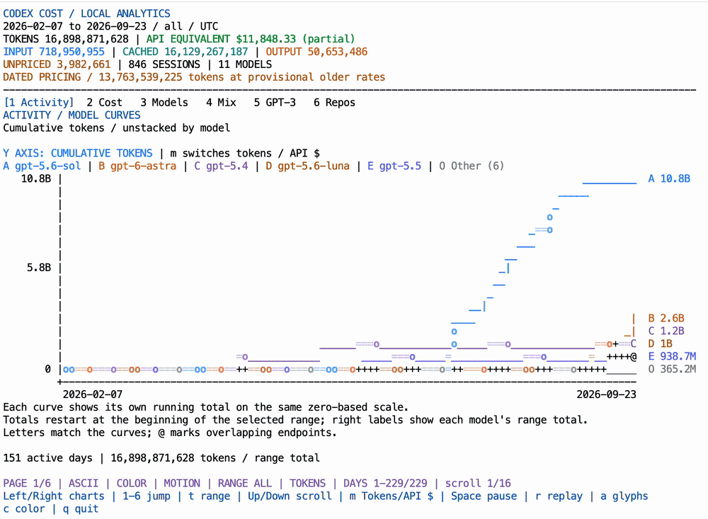

# Codex Cost

See how much Codex you've used, and what it would have cost on the API, in an animated dashboard that runs in your terminal.



<!-- Demo video: in GitHub's web editor, drag the MP4 onto the blank line below; GitHub inserts a user-attachments URL that renders as a video player. -->


https://github.com/user-attachments/assets/2849ba56-278d-447f-b76a-93fde2f991af


- **Local and private.** Reads the Codex history already on your Mac. Nothing is uploaded, and there's no API key, account sign-in, npm install, or build step.
- **Six animated screens:** Activity, Cumulative cost, Models, Token mix, GPT-3 era, and Cost by repo, over all time, 90 days, 30 days, 1 week, or 1 day.
- **Estimates, not a bill.** Dollar amounts are API-equivalent estimates, not Codex subscription charges.

## Quick start

You need **macOS with Terminal.app**, **Node.js 22.13 or newer**, and **Codex history** on the same Mac.

1. Paste this into Codex to install the skill:

   ```text
   $skill-installer install https://github.com/neelbaronia/codex-cost/tree/main/skills/codex-cost
   ```

2. Open a new Codex chat and run:

   ```text
   $codex-cost
   ```

The dashboard opens in a new Terminal window. Use Left/Right to switch screens, `t` to change the time range, and `q` to quit.

Codex detects newly installed skills automatically. If `$codex-cost` doesn't appear, restart Codex. The first time, Codex may ask to let the launcher control Terminal.app; approve that launcher command.

## Other ways to install

The plugin and the standalone skill contain the same dashboard, so install only one.

### Install the plugin

[Install Codex Cost from the official plugin directory](https://chatgpt.com/plugins/plugins_6aa57d893fbc8191b415a4321d9ce63c). Version **0.1.2** was published on **2026-09-12**.

You can also install the plugin from GitHub by running these commands in your shell:

```sh
codex plugin marketplace add neelbaronia/codex-cost --ref main
codex plugin add codex-cost@codex-cost
```

The first command registers this repository's marketplace; the second installs the plugin. Open a new Codex chat, then ask `Use Codex Cost to open my animated usage dashboard.` or select the skill from `/skills` or by typing `$`.

The plugin ZIP is also available from [GitHub releases](https://github.com/neelbaronia/codex-cost/releases).

### Run from a clone

```sh
git clone https://github.com/neelbaronia/codex-cost.git
cd codex-cost

# Open the animated dashboard in a new macOS Terminal window.
/bin/sh skills/codex-cost/scripts/open.sh

# Print a report and exit.
/bin/sh skills/codex-cost/scripts/run.sh --terminal --ascii --no-color --width 80

# Show command-line options without reading usage history.
/bin/sh skills/codex-cost/scripts/run.sh --help
```

The bundled reporting engine runs anywhere with Node.js 22.13+; only the automatic window opening is macOS-specific.

## Using it

Ask Codex for the view you want:

```text
Use $codex-cost to open my animated usage dashboard.
Use $codex-cost to open my last 30 days of usage.
Use $codex-cost to show my last 7 days as static ASCII charts in this conversation.
Use $codex-cost to show my usage as JSON.
```

| Screen | What it shows |
| --- | --- |
| **Activity** | Cumulative tokens (or dollars, with `m`) per model |
| **Cumulative cost** | API-equivalent cost building up over time, by model |
| **Models** | Every model ranked by tokens, with its share and cost |
| **Token mix** | Uncached input, cached input, and output |
| **GPT-3 era** | Your tokens priced at 2020 GPT-3 rates, a pricing thought experiment |
| **Cost by repo** | API-equivalent cost grouped by repository or directory |

Every screen summarizes the selected range. Press `t` to cycle through all time, 90 days, 30 days, 1 week, and 1 day.

Activity shows **unstacked cumulative model curves** on one zero-based scale:
each line ends at that model's own range total. The `m` key switches between
cumulative tokens and cumulative API-equivalent dollars. Narrower time ranges
start accumulation at the beginning of that range. The top five models have
separate curves; Other combines the remainder. Static activity reports and
the JSON `daily` records retain their daily values.

| Key | Action |
| --- | --- |
| Left / Right | Switch chart pages |
| `1`–`6` | Jump to a chart |
| Up / Down | Scroll the current page |
| `m` | Switch Activity between tokens and API-equivalent dollars |
| `t` | Cycle the selected range: all time, 90d, 30d, 1w, 1d |
| `a` | Toggle ASCII and Unicode/Braille |
| `c` | Toggle color |
| Space | Pause or resume animation |
| `r` | Replay the entrance animation |
| `q` | Quit the dashboard and restore its terminal |

## Privacy and estimates

Codex Cost reads your local Codex history and stores a local cache of usage and session metadata. It does not upload history or modify session logs. No usage history is included in this repository.

Dollar amounts are **API-equivalent estimates**, not Codex subscription charges or invoices. Unpriced models stay in token totals and are excluded from dollar estimates. Reasoning is already included in output; cached input is already included in logged input. Reporting periods use UTC. Deleted records, other devices, and server-only usage may be absent.

The GPT-3 era comparison is a pricing thought experiment, not a comparison of equivalent model capabilities.

## Troubleshooting

- **"Codex Cost needs Node.js 22.13 or newer."** Install or upgrade Node.js (for example, `brew install node`), then run `$codex-cost` again. The launcher checks the `node` on your PATH plus the standard Homebrew locations.
- **Codex says the launch was blocked by its sandbox.** Approve the specific launcher command when Codex asks. It needs permission to open a Terminal window.
- **`$codex-cost` doesn't appear.** Restart Codex, or check that `~/.codex/skills/codex-cost` exists.
- **Numbers look lower than expected.** Only history stored on this Mac is counted; usage from other devices or deleted sessions is not included.

## Update or uninstall

**Standalone skill:** the installer won't overwrite an existing copy. To update, delete `~/.codex/skills/codex-cost` and run the install command again. To uninstall, just delete that folder.

**Plugin from GitHub:** refresh the marketplace with `codex plugin marketplace upgrade codex-cost`. To uninstall, run `codex plugin remove codex-cost@codex-cost`.

## Pricing details

Costs use **dated price history**: each usage event uses the applicable rate
before totals are combined into charts. Future price updates append versions and
do not overwrite old prices. Identical token usage before and after a price change
can therefore have different costs. JSON exposes the preserved ledger and applied
period subtotals for auditing.

Older usage predating the original pricing snapshot keeps its previous estimate,
but is clearly marked **provisional** because its historical rate was not verified.
Missing timestamps or unavailable rates remain unpriced. See
[pricing history and update rules](skills/codex-cost/PRICING-HISTORY.md) for exact
boundaries, source provenance, cache behavior, and limitations.

Pricing checked September 22, 2026 includes GPT-6 Sol (`gpt-6-sol`) and GPT-6
Luna (`gpt-6-luna`). Standard rates per million tokens are $2 / $0.20 / $10 for
Sol and $0.10 / $0.01 / $0.50 for Luna (input / cached input / output).
Recorded cache writes and prompts above 272,000 input tokens use their published
rates from [OpenAI API pricing](https://developers.openai.com/api/docs/pricing).
Both models appear in the token and dollar charts with distinct colors.

## For contributors and reviewers

Run `python3 review/check-model-pricing.py` to verify the bundled rates and
accounting using synthetic history, and `python3 review/check-pricing-history.py`
for price-change boundary tests, including warm caches, future versions,
long-context thresholds, and preservation of old rates. Both checks accept
`--runner /absolute/path/to/scripts/run.sh`.

The [submission packet](SUBMISSION.md) includes listing copy and reviewer setup; [synthetic test cases](review/TEST-CASES.md) let reviewers inspect usage reports without personal history.

The plugin lives at the repository root. [`plugin.json`](plugin.json) declares the portable plugin identity, [`.codex-plugin/plugin.json`](.codex-plugin/plugin.json) supplies Codex presentation metadata and compatibility, and [`.agents/plugins/marketplace.json`](.agents/plugins/marketplace.json) makes the plugin installable from this GitHub repository.

The standalone installable folder is [`skills/codex-cost`](skills/codex-cost). Keep the whole folder together, including `scripts/chunks/`: the main script imports those bundled modules. [`SKILL.md`](skills/codex-cost/SKILL.md) contains the workflow instructions and supported options; `agents/openai.yaml` supplies the skill display metadata.

## License

[MIT](LICENSE).
